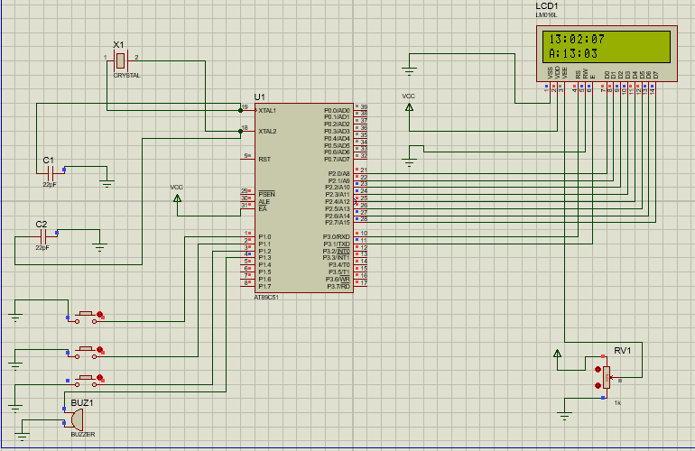

# ⏰ 8051 Smart Digital Clock System

---

## 📌 Overview
This project implements a Smart Digital Clock using 8051 microcontroller with alarm and stopwatch features.  
It displays real-time clock data on a 16x2 LCD and supports multiple modes using push buttons.

---

## 📸 Preview

  

---

## 🚀 Features
- Real-time clock  
- Alarm with buzzer  
- Stopwatch mode  
- Multi-mode operation  
- LCD display  

---

## 🛠 Components Used
- 8051 Microcontroller  
- 16x2 LCD  
- Buzzer  
- Push Buttons  
- Crystal Oscillator  

---

## ▶️ How to Run
1. Open project in Proteus  
2. Load .hex file  
3. Run simulation  
4. Use buttons to control modes  

---

## 📸 Project Output

  
  
  

  
  
  

---

## ⚙️ Working
- Time is generated using internal timer  
- LCD displays current time  
- Buttons switch between modes  
- Alarm triggers buzzer  

---

## 📌 Applications
- Digital clocks  
- Alarm systems  
- Embedded learning  

---

## 👨‍💻 Author
Purastu Harini

---

⭐ Star this repo if you like this project!
